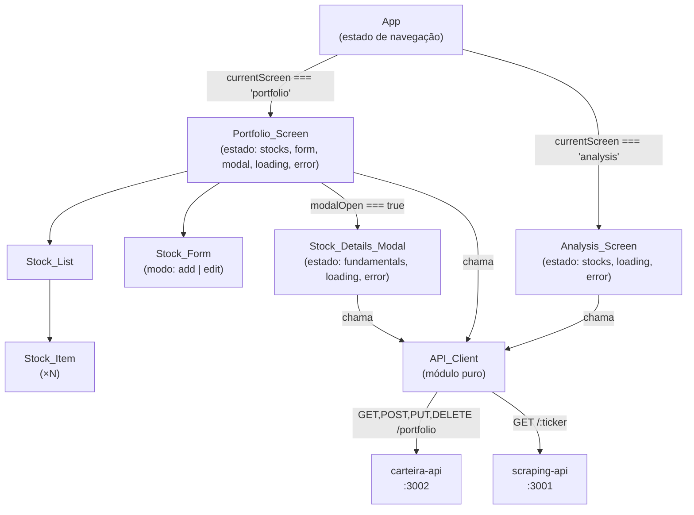
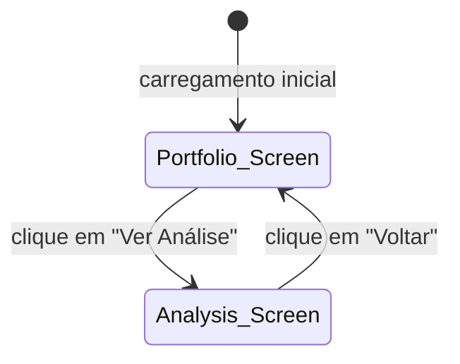
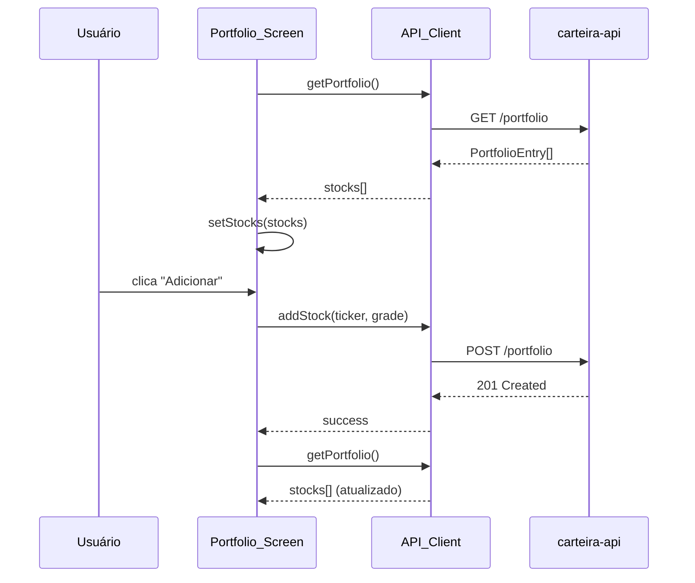
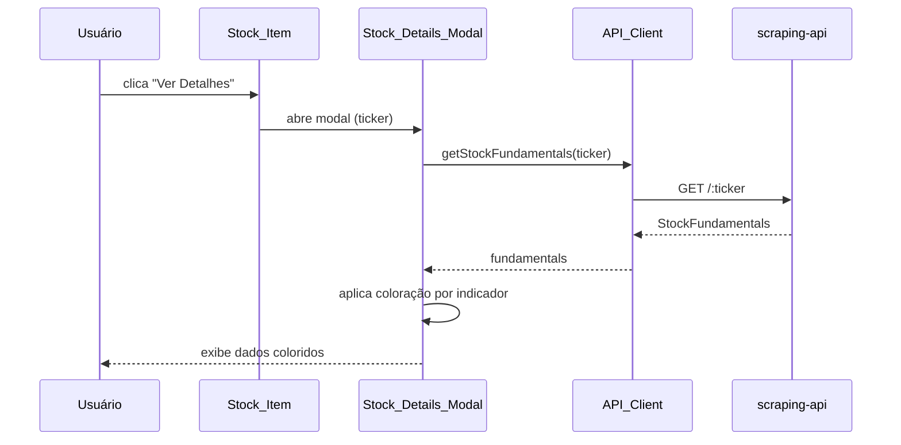

# Design Document — carteira-frontend

## Overview

O `carteira-frontend` é uma Single Page Application (SPA) React que serve como interface gráfica para o sistema Carteira 2.0. A aplicação consome dois serviços backend:

- **carteira-api** (`http://localhost:3002`) — gerencia o portfolio de stocks (CRUD + cálculo de pesos)
- **scraping-api** (`http://localhost:3001`) — fornece dados fundamentalistas de cada ação via scraping

A SPA possui duas telas e um modal:

| Componente | Responsabilidade |
|---|---|
| `Portfolio_Screen` | Tela principal — lista stocks, formulário de CRUD, acesso ao modal |
| `Analysis_Screen` | Tela secundária — exibe pesos calculados de cada stock |
| `Stock_Details_Modal` | Modal sobreposto à Portfolio_Screen — exibe indicadores fundamentalistas com coloração |

A navegação entre telas é controlada por estado React (`useState`), sem React Router, dado que são apenas duas telas. Não há necessidade de URLs distintas ou histórico de navegação.

**Stack recomendada:**
- [Vite](https://vitejs.dev/) como bundler/dev server (startup rápido, HMR nativo)
- React 18 com JavaScript (TypeScript recomendado mas opcional)
- Sem gerenciador de estado externo (Redux, Zustand) — `useState` e `useEffect` são suficientes
- Sem biblioteca de roteamento — navegação por estado local
- Fetch API nativa para chamadas HTTP (sem Axios, para manter dependências mínimas)

---

## Architecture

### Diagrama de Componentes



### Fluxo de Navegação



### Fluxo de Dados — Portfolio_Screen



### Fluxo de Dados — Stock_Details_Modal



---

## Components and Interfaces

### `App`

Componente raiz. Mantém o estado de navegação (`currentScreen`) e renderiza condicionalmente a tela ativa.

```jsx
// Estado
const [currentScreen, setCurrentScreen] = useState('portfolio'); // 'portfolio' | 'analysis'

// Renderização condicional
{currentScreen === 'portfolio' && <Portfolio_Screen onNavigate={setCurrentScreen} />}
{currentScreen === 'analysis' && <Analysis_Screen onNavigate={setCurrentScreen} />}
```

**Props:** nenhuma  
**Estado:** `currentScreen: 'portfolio' | 'analysis'`

---

### `Portfolio_Screen`

Tela principal. Orquestra a listagem, o formulário de CRUD e o modal de detalhes.

**Props:**
```js
{
  onNavigate: (screen: string) => void
}
```

**Estado interno:**
```js
{
  stocks: PortfolioEntry[],      // lista carregada da API
  loading: boolean,              // requisição em andamento
  error: string | null,          // mensagem de erro global
  formMode: 'add' | 'edit',      // modo do formulário
  editingStock: PortfolioEntry | null,  // stock sendo editada
  modalTicker: string | null,    // ticker do modal aberto (null = fechado)
}
```

**Responsabilidades:**
- Chamar `getPortfolio()` no mount e após cada mutação (add/update/delete)
- Passar callbacks de edição/remoção/visualização para `Stock_Item` via `Stock_List`
- Controlar abertura/fechamento do `Stock_Details_Modal`
- Exibir erros e loading globais

---

### `Stock_List`

Componente de apresentação puro. Renderiza a lista de `Stock_Item`.

**Props:**
```js
{
  stocks: PortfolioEntry[],
  onEdit: (stock: PortfolioEntry) => void,
  onDelete: (ticker: string) => void,
  onViewDetails: (ticker: string) => void,
}
```

---

### `Stock_Item`

Representa uma única entrada do portfolio. Exibe ticker, nota e os três controles de ação.

**Props:**
```js
{
  stock: PortfolioEntry,
  onEdit: (stock: PortfolioEntry) => void,
  onDelete: (ticker: string) => void,
  onViewDetails: (ticker: string) => void,
}
```

**Renderiza:**
- Ticker e `fundamentalist_grade`
- Botão "Editar" → chama `onEdit(stock)`
- Botão "Remover" → chama `onDelete(stock.ticker)`
- Botão "Ver Detalhes" → chama `onViewDetails(stock.ticker)`

---

### `Stock_Form`

Formulário controlado para adição e edição de stocks.

**Props:**
```js
{
  mode: 'add' | 'edit',
  initialValues?: { ticker: string, fundamentalist_grade: number },
  onSubmit: (ticker: string, grade: number) => void,
  onCancel?: () => void,
}
```

**Estado interno:**
```js
{
  ticker: string,
  fundamentalistGrade: string,  // string para controle do input
  errors: { ticker?: string, grade?: string }
}
```

**Validação (client-side, antes de chamar a API):**
- `ticker`: não pode ser vazio
- `fundamentalist_grade`: deve ser número real em `(0, 100]`

No modo `edit`, o campo `ticker` é exibido como somente leitura (não editável).

---

### `Stock_Details_Modal`

Modal sobreposto que exibe os dados fundamentalistas de uma stock com coloração por indicador.

**Props:**
```js
{
  ticker: string,
  onClose: () => void,
}
```

**Estado interno:**
```js
{
  fundamentals: StockFundamentals | null,
  loading: boolean,
  error: string | null,
}
```

**Responsabilidades:**
- Chamar `getStockFundamentals(ticker)` no mount
- Aplicar `getIndicatorColor(indicator, value, fundamentals)` para cada indicador
- Indicar visualmente campos presentes em `invalid_fields`
- Fechar ao clicar no botão de fechar ou fora do modal (overlay)

---

### `Analysis_Screen`

Tela secundária que exibe os pesos calculados.

**Props:**
```js
{
  onNavigate: (screen: string) => void
}
```

**Estado interno:**
```js
{
  stocks: PortfolioEntry[],
  loading: boolean,
  error: string | null,
}
```

**Renderiza:**
- Tabela/lista com `ticker`, `fundamentalist_grade` e `weight` formatado como `XX.XX%`
- Botão "Voltar" → chama `onNavigate('portfolio')`
- Loading indicator e mensagens de erro/vazio

---

## Data Models

### `PortfolioEntry` (resposta de `GET /portfolio`)

```js
{
  id: number,
  ticker: string,
  fundamentalist_grade: number,   // (0, 100]
  weight: number,                 // decimal, ex: 0.065 (= 6.5%)
  created_at: string,             // ISO 8601
  updated_at: string,
}
```

> **Nota:** O campo `weight` retornado pela API é um decimal (ex: `0.065`). Para exibição na Analysis_Screen, formatar como `(weight * 100).toFixed(2) + '%'`.

### `StockFundamentals` (resposta de `GET /:ticker` na scraping-api)

```js
{
  symbol: string,
  price: number | null,
  pe: number | null,
  pbv: number | null,
  psr: number | null,
  bvps: number | null,
  eps: number | null,
  dy: number | null,
  source: string,
  invalid_fields: string[],       // ex: ["PE", "PSR"]
}
```

> **Nota:** A scraping-api usa chaves com capitalização mista (`PE`, `PBV`, `BVps`, `EPS`, `DY`). O API_Client deve normalizar para lowercase ao deserializar, ou o frontend deve lidar com as chaves originais. Recomenda-se normalização no API_Client.

### `IndicatorColor`

```js
type IndicatorColor = 'green' | 'red' | 'neutral'
// 'neutral' quando o campo está em invalid_fields ou o valor é null
```

---

## Correctness Properties

*A property is a characteristic or behavior that should hold true across all valid executions of a system — essentially, a formal statement about what the system should do. Properties serve as the bridge between human-readable specifications and machine-verifiable correctness guarantees.*

### Property 1: Exatamente uma tela visível por vez

*Para qualquer* sequência de ações de navegação (navegar para Analysis_Screen, voltar para Portfolio_Screen), o App SHALL manter exatamente uma tela visível por vez — nunca zero, nunca duas.

**Validates: Requirements 1.4**

---

### Property 2: Stock_List renderiza N itens para N stocks

*Para qualquer* lista de N stocks retornada pela API (N ≥ 0), a Stock_List SHALL renderizar exatamente N componentes Stock_Item.

**Validates: Requirements 2.2**

---

### Property 3: Mensagem de erro propagada ao usuário

*Para qualquer* mensagem de erro retornada pela carteira-api (status 4xx ou 5xx), a Portfolio_Screen SHALL exibir uma mensagem de erro que contém o texto retornado pela API.

**Validates: Requirements 2.4, 4.6, 5.5, 6.4**

---

### Property 4: Stock_Item exibe todos os controles de ação

*Para qualquer* stock no portfolio, o Stock_Item SHALL renderizar os três controles de ação: editar, remover e ver detalhes.

**Validates: Requirements 3.1, 5.1, 6.1**

---

### Property 5: Chamada à scraping-api usa o ticker correto

*Para qualquer* ticker presente no portfolio, ao acionar o controle de visualização do Stock_Item correspondente, o API_Client SHALL chamar `GET /:ticker` na scraping-api com exatamente aquele ticker.

**Validates: Requirements 3.2**

---

### Property 6: Modal exibe todos os campos fundamentalistas

*Para qualquer* conjunto de dados fundamentalistas retornado pela scraping-api, o Stock_Details_Modal SHALL exibir os campos `symbol`, `price`, `pe`, `pbv`, `psr`, `bvps`, `eps`, `dy` e `source`.

**Validates: Requirements 3.4**

---

### Property 7: Coloração correta dos indicadores PE, PBV, PSR, DY

*Para qualquer* valor numérico de PE, PBV, PSR ou DY não presente em `invalid_fields`, a função `getIndicatorColor` SHALL retornar:
- PE: `'green'` se `pe > 0 AND pe <= 8`, `'red'` caso contrário
- PBV: `'green'` se `pbv > 0 AND pbv <= 2`, `'red'` caso contrário
- PSR: `'green'` se `psr > 0 AND psr < 2`, `'red'` caso contrário
- DY: `'green'` se `dy >= 4`, `'red'` caso contrário

**Validates: Requirements 3.8, 3.9, 3.10, 3.11**

---

### Property 8: Coloração correta do indicador Graham

*Para qualquer* combinação de valores `price`, `eps` e `bvps` não presentes em `invalid_fields`, a função `getIndicatorColor` para Graham SHALL retornar `'green'` se e somente se `eps > 0 AND bvps > 0 AND price < sqrt(22.5 * eps * bvps)`, e `'red'` caso contrário.

**Validates: Requirements 3.12**

---

### Property 9: Campos inválidos omitem coloração

*Para qualquer* subconjunto de `invalid_fields` que inclua campos utilizados no cálculo de um indicador, a função `getIndicatorColor` SHALL retornar `'neutral'` para aquele indicador (sem coloração verde ou vermelha).

**Validates: Requirements 3.13**

---

### Property 10: Validação de fundamentalist_grade rejeita valores fora do intervalo

*Para qualquer* valor de `fundamentalist_grade` fora do intervalo `(0, 100]` (incluindo zero, negativos e valores acima de 100), o Stock_Form SHALL exibir uma mensagem de validação e não chamar a API.

**Validates: Requirements 4.5**

---

### Property 11: Submissão do formulário usa os valores informados

*Para qualquer* par `(ticker, fundamentalist_grade)` válido submetido pelo Stock_Form, o API_Client SHALL ser chamado com exatamente aqueles valores — sem transformação ou truncamento.

**Validates: Requirements 4.2, 5.3**

---

### Property 12: Remoção atualiza a lista corretamente

*Para qualquer* stock presente na lista, após remoção bem-sucedida, a Stock_List SHALL não conter mais aquela stock, e todas as demais stocks SHALL permanecer na lista.

**Validates: Requirements 6.3**

---

### Property 13: Analysis_Screen exibe weight formatado como percentual

*Para qualquer* lista de stocks com campo `weight` retornado pela API, a Analysis_Screen SHALL exibir o peso de cada stock formatado como percentual (ex: `weight = 0.065` → `"6.50%"`).

**Validates: Requirements 7.2**

---

### Property 14: API_Client usa URLs base corretas

*Para qualquer* operação do API_Client, as requisições à carteira-api SHALL usar a URL base `http://localhost:3002` e as requisições à scraping-api SHALL usar a URL base `http://localhost:3001`.

**Validates: Requirements 8.1, 8.2**

---

### Property 15: API_Client propaga erros HTTP com mensagem da API

*Para qualquer* resposta HTTP com status 4xx ou 5xx de qualquer uma das APIs, o API_Client SHALL lançar um erro cujo `message` contém o texto de erro retornado no corpo da resposta.

**Validates: Requirements 8.4, 8.5**

---

## Error Handling

### Estratégia geral

Todos os erros de rede e HTTP são capturados no API_Client e relançados como `Error` com mensagem descritiva. Os componentes que chamam o API_Client usam `try/catch` em blocos `async/await` e armazenam a mensagem em estado local (`error: string | null`).

### Hierarquia de erros

```
API_Client.getPortfolio()
  → lança Error("Falha ao carregar portfolio: <mensagem da API>")
  → Portfolio_Screen captura → setError(e.message) → exibe <ErrorMessage>

API_Client.getStockFundamentals(ticker)
  → lança Error("Falha ao buscar dados de <ticker>: <mensagem da API>")
  → Stock_Details_Modal captura → setError(e.message) → exibe erro no modal
```

### Casos de erro tratados

| Situação | Componente | Comportamento |
|---|---|---|
| `GET /portfolio` falha | Portfolio_Screen | Exibe mensagem de erro; lista não é renderizada |
| `POST /portfolio` falha | Portfolio_Screen | Exibe mensagem de erro; lista não é atualizada |
| `PUT /portfolio` falha | Portfolio_Screen | Exibe mensagem de erro; lista não é atualizada |
| `DELETE /portfolio/:ticker` falha | Portfolio_Screen | Exibe mensagem de erro; lista não é atualizada |
| `GET /:ticker` falha | Stock_Details_Modal | Exibe mensagem de erro dentro do modal |
| `GET /portfolio` falha | Analysis_Screen | Exibe mensagem de erro; tabela não é renderizada |
| Validação client-side falha | Stock_Form | Exibe mensagem inline por campo; não chama API |

### Limpeza de erros

O estado de erro é limpo (`setError(null)`) antes de cada nova requisição, para que erros anteriores não persistam após uma operação bem-sucedida.

---

## Testing Strategy

### Abordagem

Dois arquivos de teste cobrem os pontos críticos da aplicação:

- **`src/utils/indicators.test.js`** — PBT com fast-check para a função `getIndicatorColor` (Propriedades 7, 8, 9). Única lógica de negócio pura da aplicação; replica as regras do backend Go e deve ser verificada para qualquer combinação de inputs.
- **`src/api/client.test.js`** — Testes de exemplo com fetch mockado para verificar URLs base corretas (Propriedade 14) e propagação de erros HTTP (Propriedade 15). O API_Client é o ponto de integração com os dois backends; erros aqui afetam toda a aplicação.

Os demais comportamentos (navegação, renderização de listas, formulários, modal) são verificáveis manualmente e não justificam o overhead de setup do testing-library para um frontend simples.

### Tooling

| Ferramenta | Uso |
|---|---|
| [Vitest](https://vitest.dev/) | Test runner (integrado ao Vite, sem configuração extra) |
| [fast-check](https://fast-check.io/) | Property-based testing (apenas `indicators.test.js`) |
| `vi.fn()` / `vi.mock()` | Mocking do fetch global em `client.test.js` |

### Configuração de PBT

Cada teste de propriedade deve rodar com mínimo de **100 iterações** (padrão do fast-check). Tag de referência obrigatória em cada teste:

```js
// Feature: carteira-frontend, Property 7: Coloração correta dos indicadores PE, PBV, PSR, DY
```

### Cobertura por arquivo

#### `src/utils/indicators.test.js` — função `getIndicatorColor`

Função pura sem efeitos colaterais — ideal para property-based testing. Cobre as Propriedades 7, 8 e 9.

```js
// Feature: carteira-frontend, Property 7: Coloração correta dos indicadores PE, PBV, PSR, DY
fc.assert(fc.property(
  fc.float({ min: -1000, max: 1000, noNaN: true }),
  (pe) => {
    const color = getIndicatorColor('pe', { pe, invalid_fields: [] });
    if (pe > 0 && pe <= 8) return color === 'green';
    return color === 'red';
  }
), { numRuns: 100 });

// Feature: carteira-frontend, Property 8: Coloração correta do indicador Graham
fc.assert(fc.property(
  fc.record({
    price: fc.float({ min: 0.01, max: 10000, noNaN: true }),
    eps:   fc.float({ min: 0.01, max: 1000,  noNaN: true }),
    bvps:  fc.float({ min: 0.01, max: 1000,  noNaN: true }),
  }),
  ({ price, eps, bvps }) => {
    const color = getIndicatorColor('graham', { price, eps, bvps, invalid_fields: [] });
    const graham = Math.sqrt(22.5 * eps * bvps);
    if (price < graham) return color === 'green';
    return color === 'red';
  }
), { numRuns: 100 });

// Feature: carteira-frontend, Property 9: Campos inválidos omitem coloração
fc.assert(fc.property(
  fc.constantFrom('pe', 'pbv', 'psr', 'dy', 'graham'),
  fc.array(fc.constantFrom('PE', 'PBV', 'PSR', 'DY', 'EPS', 'BVps', 'Price'), { minLength: 1 }),
  (indicator, invalidFields) => {
    const color = getIndicatorColor(indicator, { invalid_fields: invalidFields });
    return color === 'neutral';
  }
), { numRuns: 100 });
```

#### `src/api/client.test.js` — API_Client

Testes de exemplo com fetch mockado. Cobre as Propriedades 14 e 15.

```js
// Feature: carteira-frontend, Property 14: API_Client usa URLs base corretas
it('getPortfolio usa URL base da carteira-api', async () => {
  global.fetch = vi.fn().mockResolvedValue({ ok: true, json: async () => [] });
  await getPortfolio();
  expect(fetch).toHaveBeenCalledWith(expect.stringContaining('http://localhost:3002'));
});

it('getStockFundamentals usa URL base da scraping-api', async () => {
  global.fetch = vi.fn().mockResolvedValue({ ok: true, json: async () => ({}) });
  await getStockFundamentals('WEGE3');
  expect(fetch).toHaveBeenCalledWith(expect.stringContaining('http://localhost:3001'));
});

// Feature: carteira-frontend, Property 15: API_Client propaga erros HTTP com mensagem da API
it('lança erro com mensagem da API em resposta 4xx', async () => {
  global.fetch = vi.fn().mockResolvedValue({
    ok: false,
    status: 404,
    json: async () => ({ error: 'ticker não encontrado' }),
  });
  await expect(getPortfolio()).rejects.toThrow('ticker não encontrado');
});
```

### Estrutura de arquivos de teste

```
src/
├── utils/
│   └── indicators.test.js      # PBT — Propriedades 7, 8, 9
└── api/
    └── client.test.js          # Exemplos — Propriedades 14, 15
```

---

## Project Structure

```
carteira-2.0-golang/carteira-frontend/
├── index.html
├── vite.config.js
├── package.json
└── src/
    ├── main.jsx                    # Ponto de entrada — monta <App /> no DOM
    ├── App.jsx                     # Componente raiz — estado de navegação
    │
    ├── api/
    │   └── client.js               # API_Client — todas as chamadas HTTP
    │
    ├── utils/
    │   └── indicators.js           # getIndicatorColor() — lógica de coloração
    │
    ├── components/
    │   ├── Portfolio_Screen.jsx    # Tela principal
    │   ├── Analysis_Screen.jsx     # Tela de análise
    │   ├── Stock_List.jsx          # Lista de stocks
    │   ├── Stock_Item.jsx          # Item individual da lista
    │   ├── Stock_Form.jsx          # Formulário add/edit
    │   └── Stock_Details_Modal.jsx # Modal de dados fundamentalistas
    │
    └── styles/
        └── index.css               # Estilos globais (opcional — pode usar CSS modules)
```

---

## API Client — Especificação

O módulo `src/api/client.js` centraliza todas as chamadas HTTP. Cada função é `async` e lança `Error` em caso de resposta não-ok.

```js
const CARTEIRA_API = 'http://localhost:3002';
const SCRAPING_API = 'http://localhost:3001';

async function handleResponse(response) {
  if (!response.ok) {
    const body = await response.json().catch(() => ({ error: response.statusText }));
    throw new Error(body.error || `HTTP ${response.status}`);
  }
  return response.json();
}

export async function getPortfolio() {
  const res = await fetch(`${CARTEIRA_API}/portfolio`);
  return handleResponse(res);
}

export async function addStock(ticker, fundamentalistGrade) {
  const res = await fetch(`${CARTEIRA_API}/portfolio`, {
    method: 'POST',
    headers: { 'Content-Type': 'application/json' },
    body: JSON.stringify({ ticker, fundamentalist_grade: fundamentalistGrade }),
  });
  return handleResponse(res);
}

export async function updateStock(ticker, fundamentalistGrade) {
  const res = await fetch(`${CARTEIRA_API}/portfolio`, {
    method: 'PUT',
    headers: { 'Content-Type': 'application/json' },
    body: JSON.stringify({ ticker, fundamentalist_grade: fundamentalistGrade }),
  });
  return handleResponse(res);
}

export async function removeStock(ticker) {
  const res = await fetch(`${CARTEIRA_API}/portfolio/${encodeURIComponent(ticker)}`, {
    method: 'DELETE',
  });
  return handleResponse(res);
}

export async function getStockFundamentals(ticker) {
  const res = await fetch(`${SCRAPING_API}/${encodeURIComponent(ticker)}`);
  return handleResponse(res);
}
```

---

## Indicator Color Logic — Especificação

O módulo `src/utils/indicators.js` expõe a função `getIndicatorColor`, que é pura (sem efeitos colaterais) e testável de forma isolada.

```js
/**
 * Retorna a cor de um indicador fundamentalista.
 * @param {string} indicator - 'pe' | 'pbv' | 'psr' | 'dy' | 'graham'
 * @param {object} fundamentals - objeto com os campos da scraping-api
 * @returns {'green' | 'red' | 'neutral'}
 */
export function getIndicatorColor(indicator, fundamentals) {
  const { pe, pbv, psr, dy, price, eps, bvps, invalid_fields = [] } = fundamentals;

  switch (indicator) {
    case 'pe':
      if (invalid_fields.includes('PE') || pe == null) return 'neutral';
      return pe > 0 && pe <= 8 ? 'green' : 'red';

    case 'pbv':
      if (invalid_fields.includes('PBV') || pbv == null) return 'neutral';
      return pbv > 0 && pbv <= 2 ? 'green' : 'red';

    case 'psr':
      if (invalid_fields.includes('PSR') || psr == null) return 'neutral';
      return psr > 0 && psr < 2 ? 'green' : 'red';

    case 'dy':
      if (invalid_fields.includes('DY') || dy == null) return 'neutral';
      return dy >= 4 ? 'green' : 'red';

    case 'graham': {
      const depsInvalid = ['EPS', 'BVps', 'Price'].some(f => invalid_fields.includes(f));
      if (depsInvalid || eps == null || bvps == null || price == null) return 'neutral';
      if (eps <= 0 || bvps <= 0) return 'red';
      const grahamValue = Math.sqrt(22.5 * eps * bvps);
      return price < grahamValue ? 'green' : 'red';
    }

    default:
      return 'neutral';
  }
}
```

> **Decisão de design:** A função recebe o objeto `fundamentals` completo (incluindo `invalid_fields`) em vez de valores individuais. Isso evita que o chamador precise verificar `invalid_fields` antes de chamar a função — a lógica de omissão de coloração fica encapsulada.

> **Alinhamento com o backend:** As regras de coloração replicam exatamente as funções `isPeGood`, `isPbvGood`, `isPsrGood`, `isDyGood` e `isGrahamGood` definidas em `carteira-api/internal/models/stock_model.go`.
