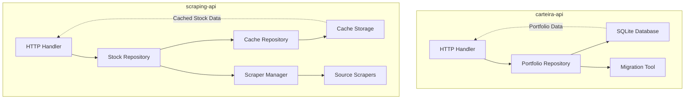
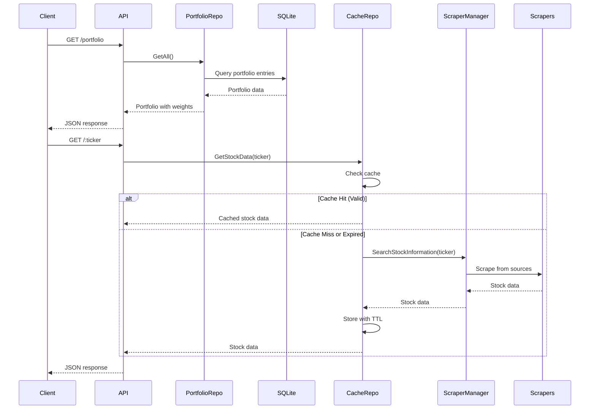

# Design Document

## Overview

This feature enhances the portfolio management system by implementing two key improvements:

1. **SQLite Persistence for Portfolio Data**: Replace the current in-memory stock portfolio storage in `carteira-api` with a persistent SQLite database. This ensures portfolio data survives application restarts and enables data management capabilities.

2. **Caching with 1-Day TTL for Scraped Data**: Add a caching layer to `scraping-api` that stores successfully scraped stock information with a 1-day Time-To-Live (TTL). This reduces redundant scraping operations, improves response times, and reduces load on external data sources.

The design addresses both components while maintaining API compatibility and ensuring data integrity throughout the application.

## Architecture

### System Architecture



### Component Interaction Diagram



## Components and Interfaces

### Portfolio Repository (carteira-api)

The `PortfolioRepository` provides persistence for portfolio data using SQLite.

```go
type PortfolioRepository interface {
    // Load all portfolio entries from database
    GetAll() ([]*PortfolioEntry, error)
    
    // Add a new stock to the portfolio
    Add(ticker string, fundamentalistGrade float64) error
    
    // Update an existing stock in the portfolio
    Update(ticker string, fundamentalistGrade float64) error
    
    // Remove a stock from the portfolio
    Remove(ticker string) error
    
    // Calculate weights for all portfolio entries
    CalculateWeights() error
}
```

### Cache Repository (scraping-api)

The `CacheRepository` provides caching for scraped stock data with TTL support.

```go
type CacheRepository interface {
    // Get stock data from cache or trigger fresh scrape
    GetStockData(symbol string) (*StockData, error)
    
    // Store stock data in cache with TTL
    StoreStockData(data *StockData) error
    
    // Check if cached data exists and is valid
    HasValidCache(symbol string) (bool, error)
    
    // Invalidate cache entry
    Invalidate(symbol string) error
    
    // Manual refresh - invalidate and fetch fresh data
    Refresh(symbol string) (*StockData, error)
}
```

### Data Models

#### StockData Model

```go
type StockData struct {
    Symbol      string     `json:"Symbol"`
    Price       *float64   `json:"Price"`
    PE          *float64   `json:"PE"`
    PBV         *float64   `json:"PBV"`
    PSR         *float64   `json:"PSR"`
    BVps        *float64   `json:"BVps"`
    EPS         *float64   `json:"EPS"`
    DY          *float64   `json:"DY"`
    Source      string     `json:"Source"`
    CreatedAt   time.Time  `json:"CreatedAt"`
    UpdatedAt   time.Time  `json:"UpdatedAt"`
    // Interno: quais campos estão vazios/inválidos
    invalidFields map[string]bool
}
```

#### PortfolioEntry Model

```go
type PortfolioEntry struct {
    ID                  int64     `json:"id"`
    Ticker              string    `json:"ticker"`
    FundamentalistGrade float64   `json:"fundamentalist_grade"`
    CreatedAt           time.Time `json:"created_at"`
    UpdatedAt           time.Time `json:"updated_at"`
}
```

## Data Models

### SQLite Database Schema

#### Table: portfolio_entries

| Column | Type | Description |
|--------|------|-------------|
| id | INTEGER PRIMARY KEY AUTOINCREMENT | Unique identifier |
| ticker | TEXT NOT NULL UNIQUE | Stock ticker symbol |
| fundamentalist_grade | REAL NOT NULL | Fundamentalist grade (0-100) |
| created_at | TIMESTAMP DEFAULT CURRENT_TIMESTAMP | Creation timestamp |
| updated_at | TIMESTAMP DEFAULT CURRENT_TIMESTAMP | Last update timestamp |

#### Table: stock_cache

| Column | Type | Description |
|--------|------|-------------|
| symbol | TEXT PRIMARY KEY | Stock ticker symbol |
| price | REAL | Price value |
| pe | REAL | P/E ratio |
| pbv | REAL | P/BV ratio |
| psr | REAL | P/SR ratio |
| bvps | REAL | Book value per share |
| eps | REAL | Earnings per share |
| dy | REAL | Dividend yield |
| source | TEXT | Data source name |
| created_at | TIMESTAMP | Cache creation timestamp |
| expires_at | TIMESTAMP | Cache expiration timestamp |
| invalid_fields | TEXT | JSON array of invalid field names |

#### Database Schema Versioning

| Table: schema_version |
|------------------------|
| version | INTEGER PRIMARY KEY |
| migrated_at | TIMESTAMP DEFAULT CURRENT_TIMESTAMP |

### Cache Storage Structure

The cache uses a time-based expiration strategy with the following structure:

```
Cache Entry:
{
  "symbol": "PETR4",
  "price": 25.50,
  "pe": 8.5,
  "pbv": 1.2,
  "psr": 1.8,
  "bvps": 12.34,
  "eps": 2.15,
  "dy": 4.5,
  "source": "investidor10",
  "created_at": "2024-01-15T10:30:00Z",
  "expires_at": "2024-01-16T10:30:00Z",
  "invalid_fields": ["pe", "dy"]
}
```

### Configuration Structure

```go
type Config struct {
    DatabasePath   string `env:"DATABASE_PATH" envDefault:"./portfolio.db"`
    CacheTTlHours  int    `env:"CACHE_TTL_HOURS" envDefault:"24"`
    CacheEnabled   bool   `env:"CACHE_ENABLED" envDefault:"true"`
}
```

## Correctness Properties

### Property 1: Portfolio Entry Persistence Round Trip

*For any* valid portfolio entry with a ticker and fundamentalist grade, adding it to the portfolio repository and then retrieving it should return an equivalent entry with the same ticker and fundamentalist grade.

**Validates: Requirements 1.3, 1.4**

### Property 2: Portfolio Entry Removal

*For any* portfolio entry that exists in the database, removing it should result in subsequent retrieval returning no entry for that ticker.

**Validates: Requirements 1.4**

### Property 3: Portfolio Weight Calculation Consistency

*For any* set of portfolio entries in the database, calculating weights should produce consistent results where all weights sum to 100% and each weight is proportional to the fundamentalist grade.

**Validates: Requirements 1.5**

### Property 4: Stock Data Persistence Round Trip

*For any* valid StockData object with all fields populated, persisting it to the database and then retrieving it should return an equivalent object with all fields preserved.

**Validates: Requirements 3.2, 3.3**

### Property 5: Null Field Preservation

*For any* StockData object with null fields, persisting it to the database and then retrieving it should return an equivalent object with the same fields as nil pointers.

**Validates: Requirements 3.5**

### Property 6: Cache Storage for Valid Data

*For any* valid StockData object (with no invalid fields), storing it in the cache should result in a cache entry that exists and is valid until expiration.

**Validates: Requirements 2.1**

### Property 7: Cache Rejection of Invalid Data

*For any* StockData object with invalid fields, storing it in the cache should not create a cache entry.

**Validates: Requirements 2.4**

### Property 8: Cache Hit for Valid Non-Expired Data

*For any* valid cache entry that has not expired, checking for cache validity should return true and retrieving the data should return the cached entry.

**Validates: Requirements 2.2**

### Property 9: Cache Miss for Expired Data

*For any* cache entry that has expired, checking for cache validity should return false and retrieving the data should trigger a fresh scrape.

**Validates: Requirements 2.3**

### Property 10: Cache Preservation on Complete Failure

*For any* stock data request where all scrapers fail, the existing cache entry (if any) should not be invalidated.

**Validates: Requirements 4.1**

### Property 11: Cache Invalidation on Expiration Access

*For any* cache entry that has expired and is accessed, it should be invalidated after returning the cache miss.

**Validates: Requirements 4.2**

### Property 12: Manual Cache Refresh

*For any* stock symbol with an existing cache entry, requesting a manual refresh should invalidate the existing entry and fetch fresh data.

**Validates: Requirements 4.3**

### Property 13: API Response Format Consistency

*For any* stock data request, the API response format should be identical regardless of whether the data came from cache or fresh scraping.

**Validates: Requirements 6.1, 6.3**

### Property 14: API Response Field Completeness

*For any* stock data response, the API response should include all stock fields: Symbol, Price, PE, PBV, PSR, BVps, EPS, DY, Source, and invalid fields indicator.

**Validates: Requirements 6.2**

### Property 15: Migration Data Preservation

*For any* portfolio entry in the in-memory portfolio, migrating it to the database should preserve the ticker and fundamentalist grade.

**Validates: Requirements 8.2**

## Error Handling

### Database Error Handling

| Error Type | Handling Strategy |
|------------|-------------------|
| Connection failure | Log error, return descriptive error to caller |
| Migration failure | Log error, return error without modifying database |
| Constraint violation | Log error, return descriptive error with constraint details |
| Query failure | Log error, return descriptive error with query context |

### Cache Error Handling

| Error Type | Handling Strategy |
|------------|-------------------|
| Cache write failure | Log error, continue with fresh scraping |
| Cache read failure | Log error, trigger fresh scrape |
| Cache invalidation failure | Log error, continue operation |
| Storage operation failure | Log error, invalidate stale entry and continue |

### Error Message Format

All error messages include:
- Operation that failed (e.g., "database query", "cache store")
- Relevant identifiers (e.g., ticker symbol, entry ID)
- Specific error details from underlying systems

Example: `database query failed for ticker PETR4: constraint violation`

## Testing Strategy

### Dual Testing Approach

**Unit Tests**: Verify specific examples, edge cases, and error conditions
**Property Tests**: Verify universal properties across all inputs (when applicable)

### Property-Based Testing

The following properties will be tested using property-based testing:

1. **Portfolio Entry Persistence Round Trip** - Test adding and retrieving entries with random tickers and grades
2. **Portfolio Entry Removal** - Test removal and verify absence with random entries
3. **Stock Data Persistence Round Trip** - Test persisting and retrieving StockData with random field values
4. **Null Field Preservation** - Test null handling with randomly generated null fields
5. **Cache Storage for Valid Data** - Test caching with random valid StockData objects
6. **Cache Rejection of Invalid Data** - Test rejection with random invalid field combinations
7. **Cache Hit for Valid Non-Expired Data** - Test cache hits with random valid entries
8. **Cache Miss for Expired Data** - Test expiration with random expiration times
9. **Cache Preservation on Complete Failure** - Test failure scenarios with random failure patterns
10. **Cache Invalidation on Expiration Access** - Test invalidation with random expired entries
11. **Manual Cache Refresh** - Test refresh with random cache states
12. **API Response Format Consistency** - Test response format with random requests
13. **API Response Field Completeness** - Test field presence with random data
14. **Migration Data Preservation** - Test migration with random portfolio entries

### Unit Tests

Unit tests will cover:

1. **Database Operations**
   - Connection success and failure scenarios
   - Migration success and failure scenarios
   - Constraint violation handling
   - Query error handling

2. **Cache Operations**
   - Cache write success and failure scenarios
   - Cache read success and failure scenarios
   - Cache invalidation success and failure scenarios
   - TTL expiration edge cases

3. **Error Handling**
   - Error message format validation
   - Error propagation through layers
   - Logging verification

4. **Integration Points**
   - Repository interface implementations
   - HTTP handler integration
   - Configuration loading

### Test Configuration

- Property-based tests: Minimum 100 iterations per property
- Unit tests: Cover success, failure, and edge cases
- Integration tests: Verify end-to-end workflows

### Property Test Tagging

Each property-based test will be tagged with:
```
Feature: portfolio-management-enhancements, Property {number}: {property_text}
```

## Migration Strategy

### Database Migration Process

1. **Initial Schema Creation**
   - Check if database file exists
   - If not, create database with initial schema
   - Set schema version to 1

2. **Schema Version Check**
   - Read current schema version from database
   - Compare with latest schema version
   - If outdated, run migration scripts

3. **Migration Scripts**
   - Each migration script increments schema version
   - Migrations are applied sequentially
   - If migration fails, log error and return without modifying database

4. **Portfolio Migration**
   - On first run with existing in-memory portfolio
   - Create database and populate with existing entries
   - Verify data integrity after migration

### Migration Tool Implementation

```go
type MigrationTool struct {
    db *sql.DB
}

func (m *MigrationTool) MigratePortfolio(inMemoryPortfolio []*StockInPortfolio) error {
    // Create database if not exists
    // Run schema migrations
    // Migrate portfolio entries
    // Verify data integrity
}
```

## Configuration

### Environment Variables

| Variable | Default | Description |
|----------|---------|-------------|
| DATABASE_PATH | ./portfolio.db | Path to SQLite database file |
| CACHE_TTL_HOURS | 24 | Cache time-to-live in hours |
| CACHE_ENABLED | true | Enable/disable caching |

### Configuration Loading

```go
func LoadConfig() (*Config, error) {
    // Load from environment variables
    // Validate values
    // Apply defaults for invalid values
    // Log warnings for invalid values
}
```

## Implementation Notes

### Repository Pattern

Both repositories will use the repository pattern to abstract data access:

- `PortfolioRepository` for carteira-api
- `CacheRepository` for scraping-api

This allows for easy testing and future changes to data storage mechanisms.

### Concurrency Considerations

- SQLite uses file-level locking for concurrent access
- Cache operations are thread-safe using mutex locks
- Portfolio weight calculation uses goroutines for parallel grade calculation

### Performance Considerations

- Cache returns data within 50ms for valid entries
- Database queries optimized with proper indexing
- Migration runs once on application startup
- Cache invalidation is asynchronous where possible
