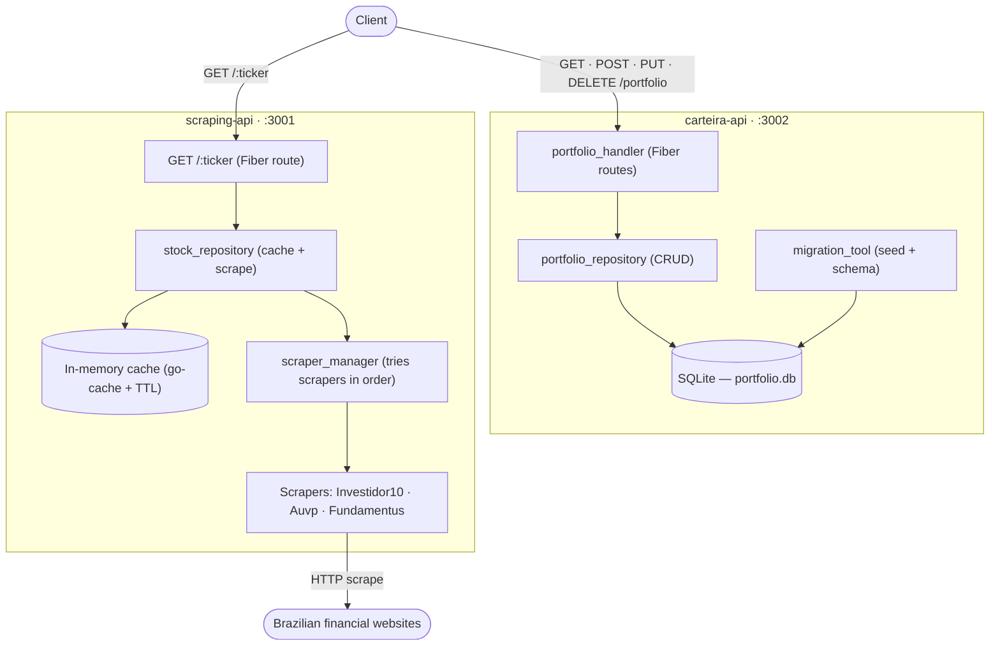

# Carteira 2.0

A portfolio management system built in Go, consisting of two independent microservices:

- **carteira-api** — manages your stock portfolio with SQLite persistence and exposes a REST API for CRUD operations
- **scraping-api** — scrapes real-time stock data from multiple sources (Investidor10, Auvp, Fundamentus) with an in-memory cache layer



---

## Prerequisites

- **Go 1.21+** (both services use Go modules)
- **GCC / CGO enabled** — required by `go-sqlite3` (a CGO-based SQLite driver)
  - macOS: install Xcode Command Line Tools (`xcode-select --install`)
  - Linux: install `build-essential` and `libsqlite3-dev`
  - Windows: install [TDM-GCC](https://jmeubank.github.io/tdm-gcc/) or use WSL
- **SQLite3** runtime library (usually pre-installed on macOS and most Linux distros)

> CGO must **not** be disabled. Do not set `CGO_ENABLED=0` when building or running either service.

---

## Getting Started

### 1. Clone the repository

```bash
git clone <repo-url>
cd carteira-2.0-golang
```

### 2. Run carteira-api

```bash
cd carteira-api
go run ./cmd/main.go
# Server starts on http://localhost:3000
```

### 3. Run scraping-api

```bash
cd scraping-api
go run ./cmd/main.go
# Server starts on http://localhost:3001
```

---

## Database Setup

### SQLite (carteira-api)

The database is created automatically — no manual setup is required.

- On first startup, `carteira-api` creates a SQLite file at the path specified by `DATABASE_PATH` (default: `./portfolio.db`).
- The schema is applied automatically using idempotent `CREATE TABLE IF NOT EXISTS` statements.
- An initial portfolio of 18 Brazilian stocks is seeded into the database on the first run. Subsequent restarts skip entries that already exist.
- Schema migrations run automatically on startup. The current schema version is tracked in the `schema_version` table.

#### Tables

| Table | Description |
|---|---|
| `portfolio_entries` | Stores tickers and their fundamentalist grades |
| `stock_cache` | Stores scraped stock data with expiry timestamps |
| `schema_version` | Tracks applied schema migrations |

#### Manual migration (optional)

Migrations are automatic, but if you need to inspect or reset the database:

```bash
# Inspect the database
sqlite3 ./portfolio.db ".tables"
sqlite3 ./portfolio.db "SELECT * FROM portfolio_entries;"

# Reset (deletes all data — use with caution)
rm ./portfolio.db
# Restart the service to recreate and reseed
```

---

## Configuration

Both services share the same environment variables. Set them before starting each service.

### Environment Variables

| Variable | Default | Description |
|---|---|---|
| `DATABASE_PATH` | `./portfolio.db` | Path to the SQLite database file. The parent directory is created automatically if it does not exist. |
| `CACHE_TTL_HOURS` | `24` | How long (in hours) scraped stock data is considered valid before a fresh scrape is triggered. Must be a positive integer; invalid values fall back to the default. |
| `CACHE_ENABLED` | `true` | Set to `false` to disable the cache and always fetch fresh data from scrapers. Any value other than `false` is treated as `true`. |

### Examples

#### Development (defaults, verbose paths)

```bash
export DATABASE_PATH=./dev-portfolio.db
export CACHE_TTL_HOURS=1
export CACHE_ENABLED=true
```

#### Production

```bash
export DATABASE_PATH=/var/data/carteira/portfolio.db
export CACHE_TTL_HOURS=24
export CACHE_ENABLED=true
```

#### Cache disabled (always scrape fresh data)

```bash
export CACHE_ENABLED=false
```

#### Short TTL for testing

```bash
export CACHE_TTL_HOURS=1
export DATABASE_PATH=/tmp/test-portfolio.db
```

---

## API Reference

### carteira-api (port 3000)

| Method | Path | Description |
|---|---|---|
| `GET` | `/portfolio` | Returns all portfolio entries with calculated weights |
| `POST` | `/portfolio` | Adds a new stock to the portfolio |
| `PUT` | `/portfolio` | Updates an existing stock's fundamentalist grade |
| `DELETE` | `/portfolio/:ticker` | Removes a stock from the portfolio |

#### POST / PUT request body

```json
{
  "ticker": "WEGE3",
  "fundamentalist_grade": 98.75
}
```

`fundamentalist_grade` must be between 0 (exclusive) and 100 (inclusive).

#### GET /portfolio response

```json
[
  {
    "id": 1,
    "ticker": "WEGE3",
    "fundamentalist_grade": 98.75,
    "weight": 0.065,
    "created_at": "2024-01-01T00:00:00Z",
    "updated_at": "2024-01-01T00:00:00Z"
  }
]
```

### scraping-api (port 3001)

| Method | Path | Description |
|---|---|---|
| `GET` | `/:ticker` | Returns scraped stock data for the given ticker |

#### GET /:ticker response

```json
{
  "symbol": "WEGE3",
  "price": 35.50,
  "pe": 28.4,
  "pbv": 8.1,
  "psr": 4.2,
  "bvps": 4.38,
  "eps": 1.25,
  "dy": 1.8,
  "source": "Investidor10",
  "invalid_fields": []
}
```

---

## Running Tests

```bash
# carteira-api tests
cd carteira-api
go test ./...

# scraping-api tests
cd scraping-api
go test ./...
```

---

## Project Structure

```
carteira-2.0-golang/
├── carteira-api/          # Portfolio management service (port 3000)
│   ├── cmd/main.go        # Entry point
│   └── internal/
│       ├── config/        # Environment variable loading
│       ├── database/      # SQLite connection and schema management
│       ├── http/          # Fiber HTTP handlers
│       ├── migration/     # One-time data migration tool
│       ├── models/        # Domain models
│       └── repository/    # Portfolio data access layer
└── scraping-api/          # Stock data scraping service (port 3001)
    ├── cmd/main.go        # Entry point
    └── internal/
        ├── cache/         # In-memory cache with TTL
        ├── config/        # Environment variable loading
        ├── http/          # HTTP client helpers
        ├── models/        # Stock data models
        ├── repository/    # Stock data access layer
        └── scraping/      # Scrapers for Investidor10, Auvp, Fundamentus
```
