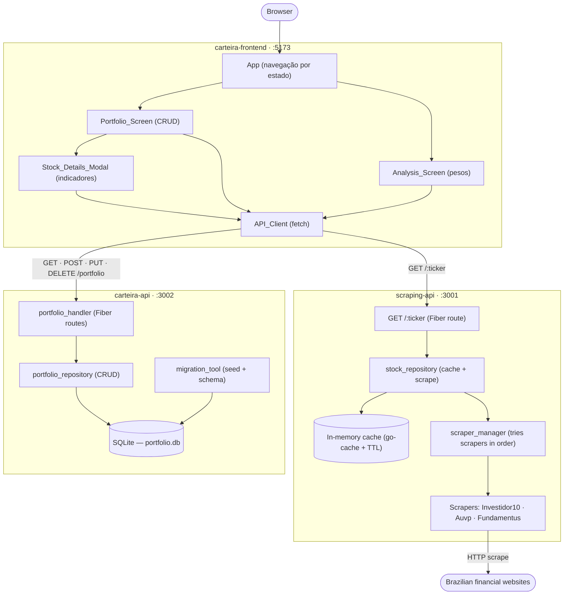

# Carteira 2.0

Sistema de gestão de carteira de ações composto por dois microserviços Go e uma interface web React:

- **carteira-api** — gerencia o portfolio com persistência SQLite e expõe uma REST API para operações de CRUD
- **scraping-api** — faz scraping de dados fundamentalistas de múltiplas fontes (Investidor10, Auvp, Fundamentus) com camada de cache em memória
- **carteira-frontend** — SPA React que consome as duas APIs e oferece interface para gerenciar o portfolio e analisar indicadores fundamentalistas



---

## Pré-requisitos

### Backend (carteira-api e scraping-api)

- **Go 1.21+** (ambos os serviços usam Go modules)
- **GCC / CGO habilitado** — exigido pelo `go-sqlite3` (driver SQLite baseado em CGO)
  - macOS: instale o Xcode Command Line Tools (`xcode-select --install`)
  - Linux: instale `build-essential` e `libsqlite3-dev`
  - Windows: instale o [TDM-GCC](https://jmeubank.github.io/tdm-gcc/) ou use WSL
- **SQLite3** (geralmente pré-instalado no macOS e na maioria das distros Linux)

> CGO **não** pode ser desabilitado. Não defina `CGO_ENABLED=0` ao compilar ou rodar os serviços.

### Frontend (carteira-frontend)

- **Node.js 18+**
- **npm 9+**

---

## Getting Started

### 1. Clone o repositório

```bash
git clone <repo-url>
cd carteira-2.0-golang
```

### 2. Rode a carteira-api

```bash
cd carteira-api
go run ./cmd/main.go
# Servidor em http://localhost:3002
```

### 3. Rode a scraping-api

```bash
cd scraping-api
go run ./cmd/main.go
# Servidor em http://localhost:3001
```

### 4. Rode o carteira-frontend

```bash
cd carteira-frontend
npm install
npm run dev
# Aplicação em http://localhost:5173
```

> As APIs precisam estar rodando antes de abrir o frontend.

---

## Configuração do Banco de Dados

### SQLite (carteira-api)

O banco é criado automaticamente — nenhuma configuração manual é necessária.

- Na primeira inicialização, a `carteira-api` cria um arquivo SQLite no caminho definido por `DATABASE_PATH` (padrão: `./portfolio.db`).
- O schema é aplicado automaticamente com instruções `CREATE TABLE IF NOT EXISTS`.
- Um portfolio inicial com 18 ações brasileiras é inserido na primeira execução. Reinicializações subsequentes ignoram entradas já existentes.
- Migrações de schema rodam automaticamente na inicialização. A versão atual é rastreada na tabela `schema_version`.

#### Tabelas

| Tabela | Descrição |
|---|---|
| `portfolio_entries` | Armazena tickers e suas notas fundamentalistas |
| `stock_cache` | Armazena dados de scraping com timestamps de expiração |
| `schema_version` | Rastreia migrações de schema aplicadas |

#### Migração manual (opcional)

As migrações são automáticas, mas se precisar inspecionar ou resetar o banco:

```bash
# Inspecionar o banco
sqlite3 ./portfolio.db ".tables"
sqlite3 ./portfolio.db "SELECT * FROM portfolio_entries;"

# Resetar (apaga todos os dados — use com cuidado)
rm ./portfolio.db
# Reinicie o serviço para recriar e reinserir os dados
```

---

## Configuração

Ambos os serviços Go compartilham as mesmas variáveis de ambiente. Defina-as antes de iniciar cada serviço.

### Variáveis de Ambiente

| Variável | Padrão | Descrição |
|---|---|---|
| `DATABASE_PATH` | `./portfolio.db` | Caminho para o arquivo SQLite. O diretório pai é criado automaticamente se não existir. |
| `CACHE_TTL_HOURS` | `24` | Por quanto tempo (em horas) os dados de scraping são considerados válidos antes de um novo scraping ser disparado. Deve ser um inteiro positivo; valores inválidos usam o padrão. |
| `CACHE_ENABLED` | `true` | Defina como `false` para desabilitar o cache e sempre buscar dados frescos dos scrapers. Qualquer valor diferente de `false` é tratado como `true`. |

### Exemplos

#### Desenvolvimento (padrões)

```bash
export DATABASE_PATH=./dev-portfolio.db
export CACHE_TTL_HOURS=1
export CACHE_ENABLED=true
```

#### Produção

```bash
export DATABASE_PATH=/var/data/carteira/portfolio.db
export CACHE_TTL_HOURS=24
export CACHE_ENABLED=true
```

#### Cache desabilitado (sempre scraping fresco)

```bash
export CACHE_ENABLED=false
```

#### TTL curto para testes

```bash
export CACHE_TTL_HOURS=1
export DATABASE_PATH=/tmp/test-portfolio.db
```

---

## Referência da API

### carteira-api (porta 3002)

| Method | Path | Description |
|---|---|---|
| `GET` | `/portfolio` | Returns all portfolio entries with calculated weights |
| `POST` | `/portfolio` | Adds a new stock to the portfolio |
| `PUT` | `/portfolio` | Updates an existing stock's fundamentalist grade |
| `DELETE` | `/portfolio/:ticker` | Removes a stock from the portfolio |

#### Corpo da requisição POST / PUT

```json
{
  "ticker": "WEGE3",
  "fundamentalist_grade": 98.75
}
```

`fundamentalist_grade` deve estar entre 0 (exclusivo) e 100 (inclusivo).

#### Resposta de GET /portfolio

```json
[
  {
    "id": 1,
    "ticker": "WEGE3",
    "fundamentalist_grade": 98.75,
    "weight": 0.065,
    "created_at": "2024-01-01T00:00:00Z",
    "updated_at": "2024-01-01T00:00:00Z"
  }
]
```

### scraping-api (porta 3001)

| Method | Path | Description |
|---|---|---|
| `GET` | `/:ticker` | Returns scraped stock data for the given ticker |

#### Resposta de GET /:ticker

```json
{
  "symbol": "WEGE3",
  "price": 35.50,
  "pe": 28.4,
  "pbv": 8.1,
  "psr": 4.2,
  "bvps": 4.38,
  "eps": 1.25,
  "dy": 1.8,
  "source": "Investidor10",
  "invalid_fields": []
}
```

---

## Rodando os Testes

```bash
# Testes da carteira-api
cd carteira-api
go test ./...

# Testes da scraping-api
cd scraping-api
go test ./...

# Testes do carteira-frontend
cd carteira-frontend
npx vitest --run
```

---

## Estrutura do Projeto

```
carteira-2.0-golang/
├── carteira-api/          # Serviço de gestão de portfolio (porta 3002)
│   ├── cmd/main.go        # Ponto de entrada
│   └── internal/
│       ├── config/        # Carregamento de variáveis de ambiente
│       ├── database/      # Conexão SQLite e gerenciamento de schema
│       ├── http/          # Handlers HTTP (Fiber)
│       ├── migration/     # Ferramenta de migração de dados
│       ├── models/        # Modelos de domínio
│       └── repository/    # Camada de acesso a dados do portfolio
├── scraping-api/          # Serviço de scraping de dados fundamentalistas (porta 3001)
│   ├── cmd/main.go        # Ponto de entrada
│   └── internal/
│       ├── cache/         # Cache em memória com TTL
│       ├── config/        # Carregamento de variáveis de ambiente
│       ├── http/          # Helpers de cliente HTTP
│       ├── models/        # Modelos de dados de ações
│       ├── repository/    # Camada de acesso a dados de ações
│       └── scraping/      # Scrapers para Investidor10, Auvp e Fundamentus
└── carteira-frontend/     # Interface web React (porta 5173)
    ├── src/
    │   ├── api/           # API_Client — chamadas HTTP centralizadas
    │   ├── components/    # Componentes React (telas, formulário, modal, lista)
    │   ├── utils/         # Lógica de coloração de indicadores
    │   └── styles/        # Estilos globais
    └── package.json
```
